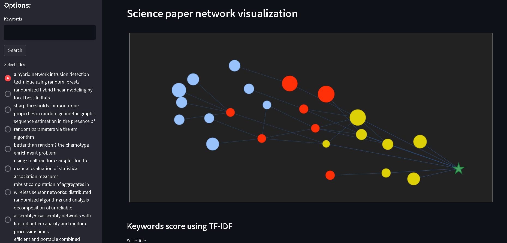

# Biểu diễn trực quan mạng lưới bài báo trích dẫn khoa học

Link: https://citation-network.herokuapp.com/

### Yêu cầu: 

Xây dựng phần mềm biểu diễn trực quan mạng lưới trích dẫn bài báo khoa học

### các nền tảng sử dụng:

* Cơ sở dữ liệu: MongoDB Atlas
* Biểu diễn graph: Pyvis
* UI: Streamlit
* Web server: Heroku
